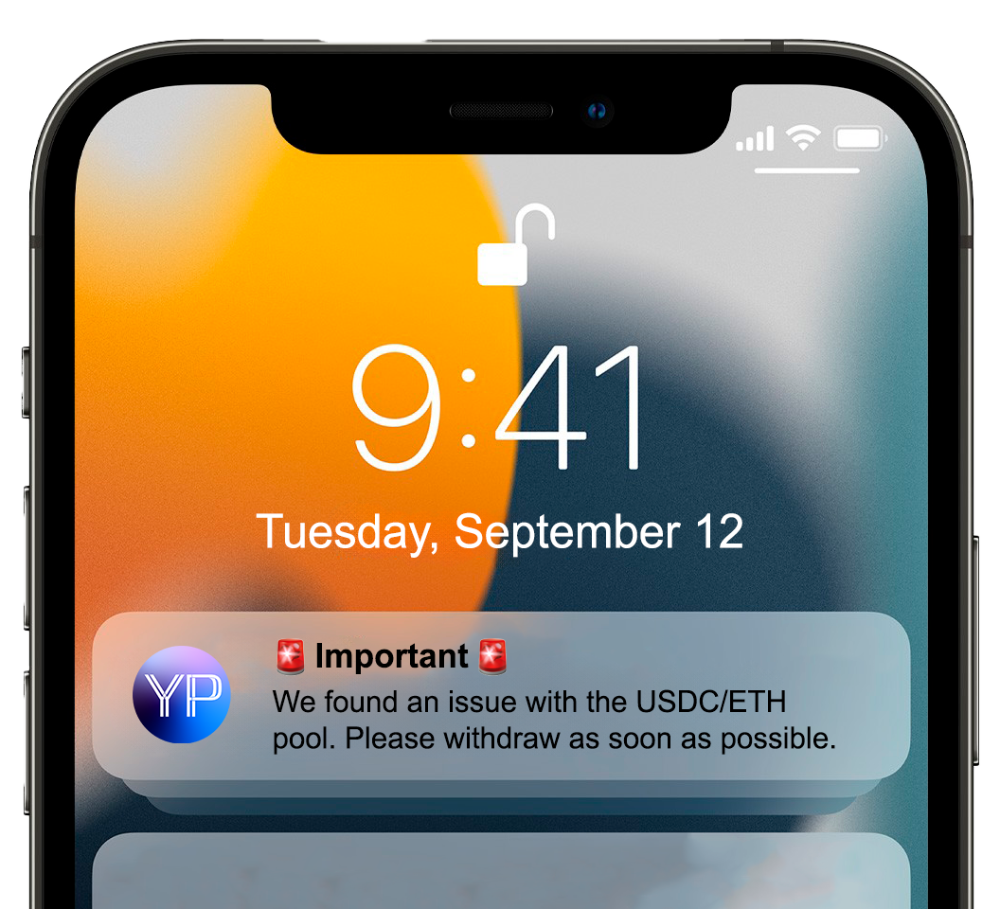

# Introduction

ChainJet is a Web3 CRM Automation platform that addresses the communication gap between Web3 protocols and their users. Unlike traditional systems where companies can easily reach out to customers via email, Web3 protocols didn't have a simple way of directly reaching their users.

ChainJet enables Web3 businesses to send targeted messaging campaigns directly to their user's wallets, allowing for a new channel of communication that doesn't require email or social network platforms. The best part is that users don't need to use special applications or configure anything. They will receive the messages on apps they are already using, like Coinbase Wallet, Lens Protocol, Converse, XMTP Inbox, Unstoppable Domains, and many more.

If your user is using at least one of the dozens of supported apps, they will get your message there, in most cases, with a notification on their phone.

<figure><figcaption>
Example message sent by your project
</figcaption></figure>

### Why ChainJet?

ChainJet is designed to fill a specific void in the Web3 ecosystem: direct and targeted communication between Web3 projects and their user base. Our platform enables you to reach users directly through their wallets. This approach creates a new communication channel with your audience without the need to increase your onboarding friction by asking and verifying email addresses, allowing for a seamless interaction that users will find both convenient and secure.

ChainJet goes beyond simple messaging, offering a suite of features like automated campaigns and AI-powered chatbots to enrich user engagement. Detailed analytics and user segmentation options further allow you to tailor your communication strategies for maximum impact. Whether it's sending out important updates, automating customer service, or implementing targeted marketing campaigns, ChainJet provides a one-stop solution to enhance your customer relationship management in the Web3 environment.

### Campaigns

Campaigns in ChainJet allow you to send messages to all your users or a segment of your users. You can use Campaigns to send newsletters or updates directly to your user's wallets.

### Chatbots

ChatBots on ChainJet are AI-powered conversational agents that can be attached directly to your wallet or ENS. These ChatBots are built to handle a range of functions, including customer support, events management, offering products and services, in-chat payments, and many more. They can be trained with your company's specific documentation and practices, allowing for automated yet personalized interactions.

### Automations

Automations on ChainJet allow you to send a message to your users when a specific on-chain or off-chain action occurs. This feature is designed to automate interactions based on triggers such as completed transactions, new NFT or collectibles minted, decentralized social media activity, and many more. ChainJet supports dozens of integrations that you can connect with your messaging campaigns.

For example, you can use automations to deliver a welcome or confirmation message when someone connects their wallet to your dApp, mints your NFT, buys your token, collects your POAP, votes on your Snapshot proposal, etc.
