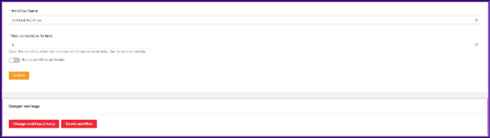

# Automations

### Overview

Automations consist of a trigger and one or more actions. The trigger specifies the event on which the actions should be executed, and the actions determine what tasks should be performed.

### Triggers

A trigger specifies the event that will start the automation. The event can be a specific interval (e.g., every 6 hours), on-chain events (e.g., each time a token is transferred), or off-chain events (e.g., a Discord command). Every time the trigger condition is satisfied, all the automation actions will be executed.

### Actions

The automation actions specify each individual task that should be performed. Automation actions can be either on-chain (e.g., transfer tokens) or off-chain (e.g., send a Discord message).

### Automations Settings

<figure><figcaption></figcaption></figure>

_**"ON/OFF"**_&#x20;

Enable or disable an automation. Enabled automations will be looking for new events, and when found, they will trigger the automation. Disabled automations won’t be automatically started (although you can still manually trigger it).

_**"FORK"**_&#x20;

Forking an automation allows you to create an exact copy of any automation. When you click it, you will be presented with a modal to select the accounts that you want to use for the new automation. If your automation is set as public, then it can be forked by other users. This is a good way of sharing your automation with the community. When the automation is forked by other users, only the automation data will be copied, but the user will have to enter their own account credentials for each integration.

_**"RUN HISTORY"**_&#x20;

<figure><figcaption></figcaption></figure>

In this section, you will be able to check the entire history of your automation, such as the last time it was executed, the number of times it was executed, whether it ran correctly or failed, the number of operations that were performed during execution, and a detail of the logs to which you can access and in case of failure you can check what the problem was.

_**"SETTINGS"**_&#x20;

<figure><figcaption></figcaption></figure>

_Automation Name:_ Enter the name of your automation.

_Max consecutive failures:_ After how many consecutive failed executions, the automation will be disabled. You can set it to zero to disable it.

_Run an automation on failure:_ You can select one of your automations to be executed each time a automation fails. This is useful for receiving custom alerts on failures.

_**Danger settings:**_

_Change automation privacy:_&#x20;

_Public_: Public automations are accessible by anyone. However, only you will be able to make changes or execute it. Credentials associated with the automation won’t be shared. Users can create copies of your automation, but they have to use their own credentials.

_Private_: Only your wallet can access the automations.

_Delete Automation:_ Allows you to permanently delete the automation. This action cannot be undone.
