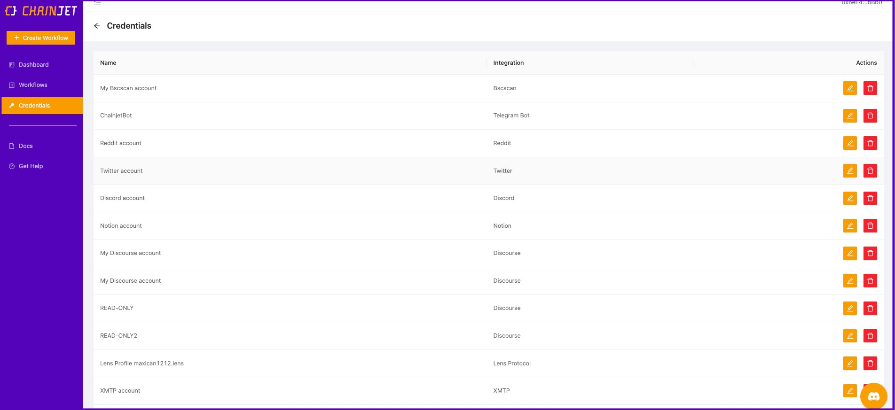

# Credentials

<figure><figcaption></figcaption></figure>

From here, you can easily:

* Edit the credential name to make it easier to recognize.
* Reconnect your account. This is very useful when you have a connection failure or your credentials have expired. Simply click the pencil button and then "Reconnect account."
* Delete a credential. By deleting the credential, you will need to connect the account for your app or service again when you want to create a new workflow using that app or service.

\
