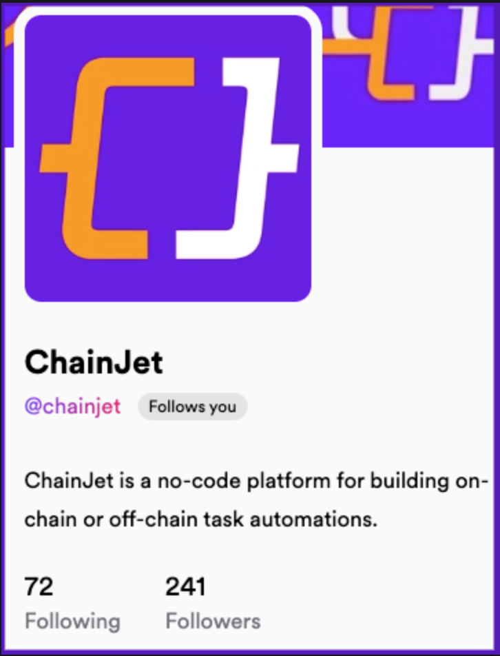

# Lens Protocol 🌿

### Fields that require additional information

* _**Profile ID or Handle**:_

The simplest thing here is to complete with your Lens Handle, your lens profile followed by .lens.

For instance, our handle is **ChainJet.lens**.

* _**Publication ID:**_

Every post, comment, and mirror on Lens Protocol has an unique ID. The easiest way to find it is on the Hey url. For instance, for the post with URL [https://hey.xyz/posts/0x012cd6-0x3b](https://hey.xyz/posts/0x012cd6-0x3b), the publication ID is 0x012cd6-0x3b.
