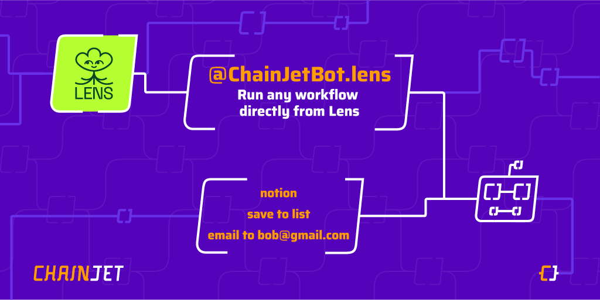

# 🤖 ChainJetBot

[@ChainJetBot.lens](https://lenster.xyz/u/chainjetbot) allows you to trigger a workflow from Lens by mentioning the bot in a post or comment.
ChainJetBot is a general-purpose bot that can help you to automate any tasks on Lens. You can automate saving posts to Notion, adding users to Lens Lists, translating posts, generating summaries, and much more!

### How does it work?
You have to create a workflow on https://chainjet.io with the trigger `Lens > New Mention to @ChainJetBot.lens`, add a keyword, and add any task(s) you want. Then comment @ChainJetBot.lens followed by your keyword, and it will execute the tasks.

### Tutorials:

* [Translate posts](translate-a-post-to-any-language-and-publish-it-with-a-comment.md)
* [Send posts by DM](send-a-post-by-dm.md)
* [Add users to a Lens list](add-a-user-to-a-lens-list.md)
* [Share posts on Discord](share-post-on-discord.md)

<figure><figcaption></figcaption></figure>
