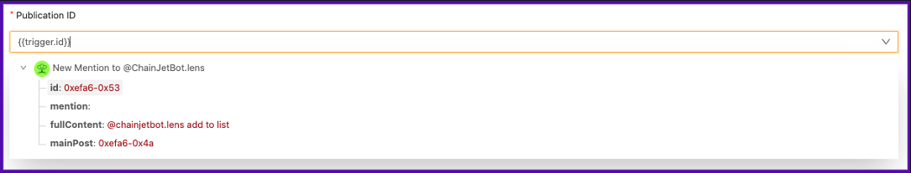
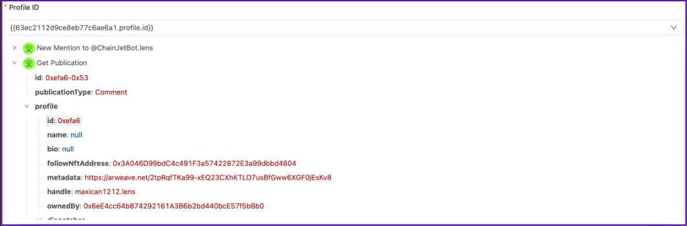

# Add a user to a Lens list

In this tutorial, we will show you how to use [@ChainJetBot.lens](https://hey.xyz/u/chainjetbot) to add a user to a Lens list simply by commenting on a post.

* Login on [ChainJet](https://chainjet.io) with your wallet. Once you're in your dashboard, click on "Create Workflow".
* The first step is to select a trigger. Click on "Add trigger" and then select the Lens Protocol integration.
* Choose the trigger "New Mention to @ChainJetBot.lens". (If this is your first time using the integration, you will need to connect your Lens profile).&#x20;
* Next, enter the word or phrase that you want to activate your workflow. In this case, we will use "Add to list".
* The next step is to select an action. Click on the "+" button below the trigger and select the Lens Protocol integration. Choose "Get Publication" and select "ID" from the drop-down menu for the Publication ID field.

<figure><figcaption></figcaption></figure>

* Finally, select a new action by clicking the "+" button below the previous action. Select the "Lens List" integration and choose "Add a user to a list".
* You will need to complete two fields: Profile ID and List ID. For the Profile ID field, select the profile ID from the drop-down menu that was obtained from the Get Publication action. The List ID can be found in the URL of your Lens List. In our case, it would be https://lists.inlens.xyz/lists/839997772555157505, and therefore the ID is 839997772555157505.

<figure><figcaption></figcaption></figure>

That's it! Your entire workflow is now ready. You can add any profile to your list simply by commenting on a post: @ChainJetBot.lens Add to list.

<figure><figcaption></figcaption></figure>

\
