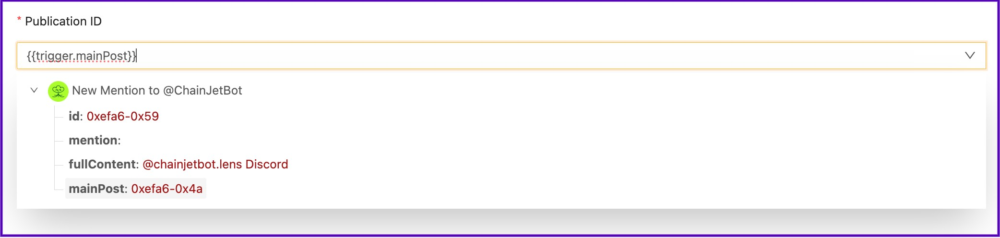
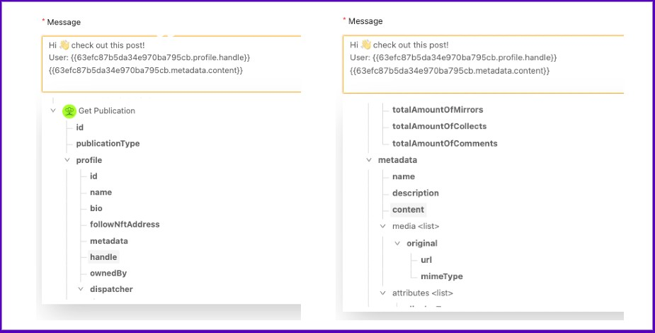

# Send a post by DM

In this tutorial, we'll show you how to send a post by DM to any Lens user with @ChainJetBot with just a comment.&#x20;

Here's how to do it:

* Log in to ChainJet with your wallet. Once you're in your dashboard, click on "Create Workflow".\

* Add a trigger, click on "Add Trigger" and select the Lens Protocol integration. Choose the trigger "New Mention to @ChainJetBot.lens". If this is your first time using the integration, you'll need to connect your Lens profile. Then, enter the keyword or phrase that you want to activate your workflow. In this case, we'll use "dm".\

* Add an action, click on the "+" button below the trigger. Select the Lens Protocol integration and choose the "Get Publication" action. Fill in the "Publication ID" field and select "Main Post" from the drop-down menu.\

<figure><figcaption></figcaption></figure>

* Add the last action, click on the "+" button under the Lens action. Select the XMTP integration, connect your account, and choose "Send a message to a Lens handle".\

* Complete two fields in this action. Firstly, select "Mention" from the drop-down menu for the Lens Handle field. This will allow you to take the handle of the Lens user you write in the comment. Secondly, fill in the message field with the information you want to send by direct message. In this example, we'll use the username and content of the post. To do this, select "Handle" and "Metadata.Content" from the drop-down menu inside the "Get Publication" action.

<figure><figcaption></figcaption></figure>

That's it! Your workflow is ready. Now, comment on a post in Lens Protocol as follows: "@ChainJetBot dm @ChainJet.lens" (you can replace "@ChainJet.lens" with the username of the Lens user you want to send the post to).

<figure><figcaption></figcaption></figure>
