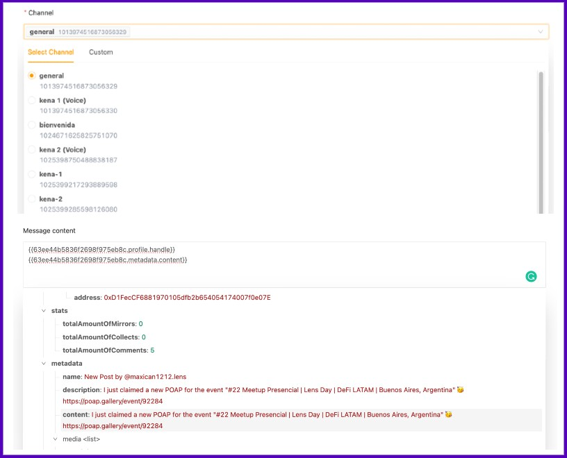

# Share post on Discord

In this tutorial, you'll learn how to use [@ChainJetBot.lens](https://lenster.xyz/u/chainjetbot) to send a Lens post to your Discord by simply mentioning the bot in a comment.

Here's how to do it:

* Login on [ChainJet](https://chainjet.io) with your wallet. Once you're in your dashboard, click on "Create Workflow''.
* Click on "Add a trigger", then select the Lens Protocol Integration, and choose "New Mention to @ChainJetBot.lens".
* Connect your Lens account and specify the word or phrase that should activate the workflow. In this case, we'll use "Discord".
* Add an action, click on the "+" button below the trigger. Select the Lens Protocol integration and choose "Get Publication" action. Then, fill in the "Publication ID" field and select "Main Post" from the drop-down menu.

<figure><figcaption></figcaption></figure>

* Finally, add the last action, click on the "+" button under the Lens action. Select the Discord integration and choose "Send a Message". (If it's your first time using this integration, you'll need to grant authorization first.)
* Select the channel where you want the Discord bot to publish the message and fill in the "Message Content" field. In this example, we'll choose "Profile.Handle" and "Metadata.Content" from the drop-down menu of the "Get Publication" action. This will show the author of the post and the content in your Discord server.

<figure><figcaption></figcaption></figure>

This is it, your workflow is ready! Now comment on the Lens post you want to share on your Discord: @ChainJetBot Discord.

<figure><figcaption></figcaption></figure>
