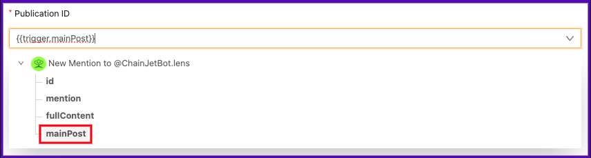

# Translate a post to any language and publish it with a comment

In this tutorial, we will use ChainJetBot to translate a post into any language and publish it as a comment. We will be using ChainJet's Lens Protocol and OpenAI integrations.&#x20;

To start, log in to [ChainJet](https://chainjet.io) with your wallet and click on "Create Workflow". Next, select the Lens Protocol integration and trigger "New Mention to @ChainJetBot.lens". If this is your first time using this integration, you will need to connect your Lens account. In the "Mention starts with" field, type "translate to".&#x20;

<figure><figcaption></figcaption></figure>

Next, we need to select the actions. Click on the "+" symbol shown below the trigger to do so. Once again, select the Lens Protocol integration and choose "Get Publication". Fill in the "Publication ID" field by selecting "Main post" from the drop-down menu.&#x20;

<figure><figcaption></figcaption></figure>

The next action we need to select is the OpenAI integration. Click on the "+" symbol below the previous action and choose "Send Prompt".

* Fill in the "Prompt" field by typing "Translate to" and then selecting "Mention" from the Mention to ChainJetBot drop-down menu and "Metadata.Content" from the Get Publication options.&#x20;

_\*If this is your first time using the OpenAI integration, you will need to connect your account with the_ [_API Key_](https://docs.chainjet.io/openai)_._&#x20;

<figure><figcaption></figcaption></figure>

Finally, we need to add a last action by selecting the "+" symbol under the previous action. Select Lens Protocol and the action "Create Comment".&#x20;

* Fill in the "Publication ID" field by selecting the "ID" option from the Get Publication drop-down menu.&#x20;
* Fill in the Comment Content field by choosing the "Text" option from the available "Send Prompt" options.&#x20;

<figure><figcaption></figcaption></figure>

Your workflow is now ready to use! To translate a Lens post, make a comment using the following format: @ChainJetBot.lens translate to \[language]. A comment will be published below with the post in the selected language.

<figure><figcaption></figcaption></figure>

<figure><figcaption></figcaption></figure>
