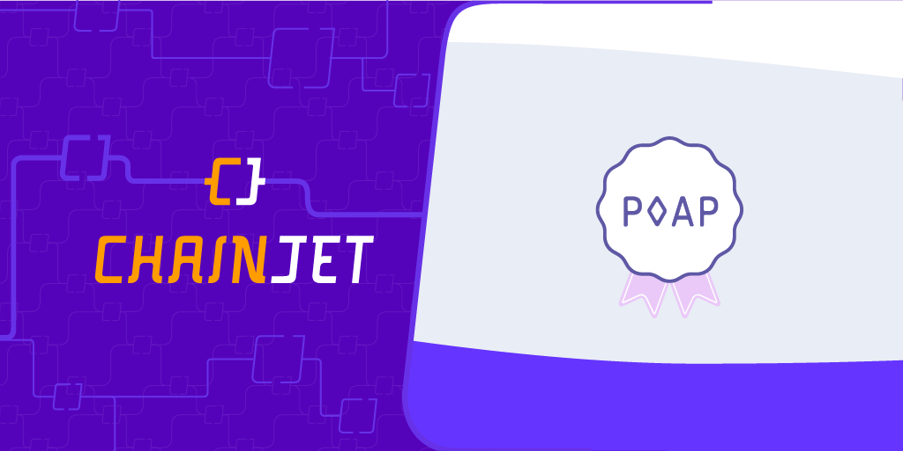

# POAP

<figure><figcaption></figcaption></figure>

### Setting Up POAP with ChainJet

To begin leveraging the power of the POAP integration within ChainJet, you only need to know the Event ID or the Wallet Address you wish to monitor for new POAPs. Simply input these details into the ChainJet interface, and your POAP-related workflows can be activated efficiently and seamlessly.

### POAP Integration:

**Triggers:**

**New POAP Collected:** This triggers when any POAP is collected by a specified wallet.

**New POAP Holder:** This triggers when any wallet collects a given POAP.

**Actions:**

**Get POAP Event:** This retrieves a POAP event by its ID.

**Get POAP Token:** This retrieves a POAP token by its ID.

### Recommended Templates:

**Send an XMTP Message to Every New POAP Holder:** This allows you to automatically send an XMTP message to each new POAP holder.

**Share Your New POAPs on Lens:** This enables automatic sharing of your new POAPs on Lens.

With ChainJet, you can connect this POAP integration with other web3 protocols, which provides an extensive range of possibilities for automating tasks in a no-code environment.
