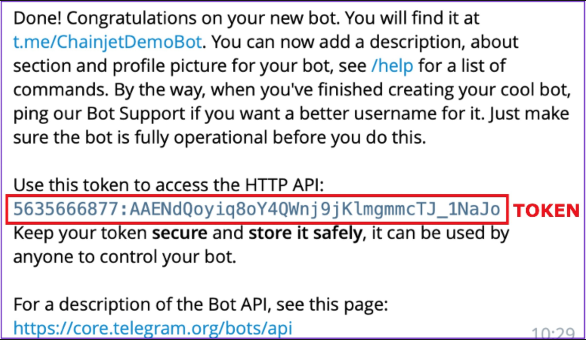
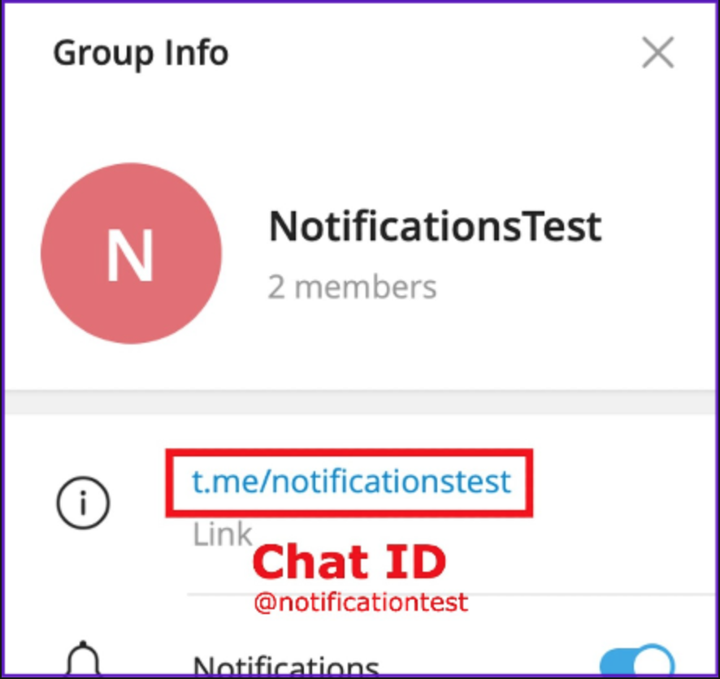
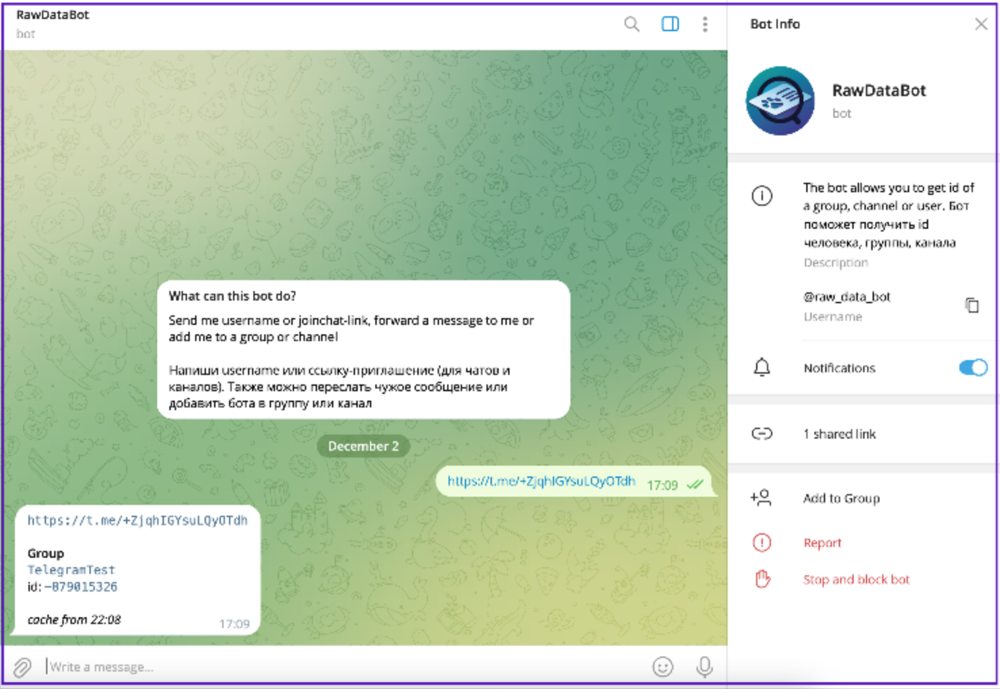

# Telegram

### Fields that require additional information

* _**How to Connect your Telegram Bot Account**_

Create a Telegram group or use one in which you are an administrator.

Create a Telegram bot (BotFahter), configure it and add it to the group. Follow the steps in the video below to set up the bot and get the token.

<figure><figcaption></figcaption></figure>

1 - Go to @BOTFATHER on Telegram\
2 - To begin creating your bot, press START. Select NEW BOT from the bot's menu and pick a name for it, and then the username ends in "bot".\
3 - Here, it will show you the token ID:

<figure><figcaption></figcaption></figure>

4 - To add the bot to your Telegram group, go to ADD MEMBER and look for your bot with the user name you've given it and add it.

* _**How to get the CHAT ID**_

If the Telegram group is **public**, simply add @ to the beginning of the group name found in the link to join. Example: if the link is: t.me/chainjet the ID will be @chainjet.

<figure><figcaption></figcaption></figure>

For **private groups**, you must use the telegram bot, [RawDataBot](https://t.me/raw\_data\_bot). Search for that user in telegram and share the group invitation link. The bot will return a message with the ID, just copy it and paste in the corresponding field in your workflow.

<figure><figcaption></figcaption></figure>

* _**Give format to Telegram texts**_

For Telegram format, you have to choose the formatting style in Parse Mode. You can use HTML, MarkdownV2 and Markdown. Remember to use in the text box the same style that you selected in Parse Mode.

Here is a [link](https://core.telegram.org/bots/api#formatting-options) where you can see all the options from these three styles.
