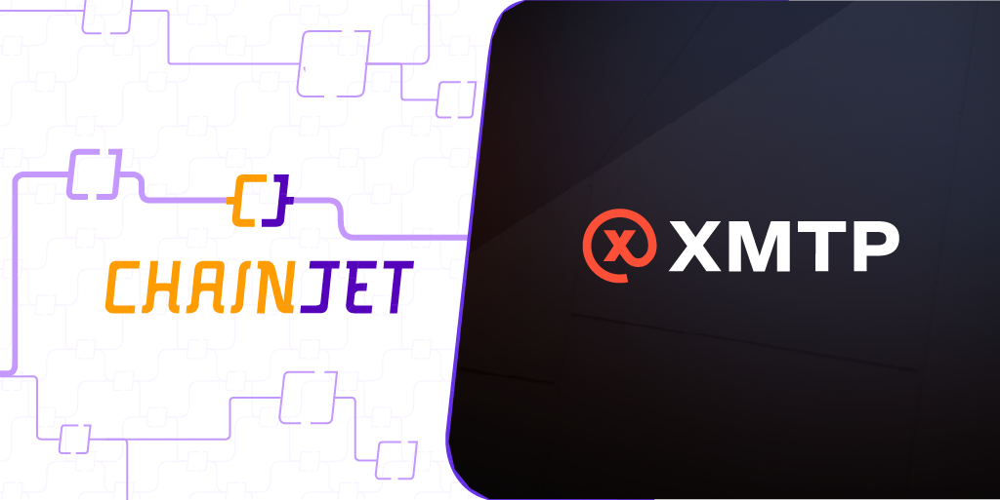

# XMTP

<figure><figcaption></figcaption></figure>

Utilizing this integration, users can establish communication between blockchain accounts, including the capability to send direct messages (DMs), alerts, announcements, among others, directly from the ChainJet platform.

### Setting Up XMTP on ChainJet:

To commence utilizing the XMTP service through ChainJet, one must first have an [XMTP account](https://xmtp.chat/). This requires logging in with your wallet.

### Available Triggers and Actions:

ChainJet provides numerous triggers and actions for the XMTP service, enabling a high degree of automation and interaction:

#### Triggers:

**1. New Conversation:** This trigger activates when a new conversation is initiated. In this context, a conversation is defined as the first message exchanged between two distinct addresses.

**2. New Message:** This trigger activates when a new message is received.

#### Actions:

**1. Check if a wallet has XMTP:** This action verifies if a specific wallet has XMTP enabled and whether it can receive messages.

**2. Send a message to a Lens handle:** This action enables you to send a message to a specific Lens handle.

**3. Send a message to a conversation:** This action enables you to send a message to an existing conversation.

**4. Send a message to a wallet:** This action allows you to send a message directly to a specific wallet.

### Recommended Templates:

To assist users in optimizing their XMTP tasks via ChainJet, we recommend the following templates:

**1.** [**Welcome new Lens followers with a DM:**](https://chainjet.io/workflows/63a9f0b125fb61a9ea27f6f8) This template allows you to send an automated direct message to every new follower on Lens.

**2.** [**Get email notifications when you receive a message on XMTP:**](https://chainjet.io/workflows/63a9f22e25fb61a9ea27faba) This template enables you to receive email notifications whenever a new XMTP message arrives.

**3.** [**Get a XMTP notification when an ENS domain is about to expire**](https://chainjet.io/workflows/63bb16c918d7845b7f1a9c4e)**:** This template delivers an XMTP notification when your ENS domain is nearing its expiration.

**4.** [**Receive a notification on XMTP when a token price moves more than X%**](https://chainjet.io/workflows/63d189ba60be310b28edbc9e)**:** This template provides an XMTP notification whenever a specific token's price fluctuates by more than a predetermined percentage.

**5.** [**Send a Lens DM to everyone who collects one of your posts**](https://chainjet.io/workflows/63d40897794370c9d10f02c4)**:** This template facilitates sending a direct message to every user who collects one of your posts on Lens.

**6.** [**Send an XMTP message to every new POAP holder**](https://chainjet.io/workflows/63da7927cffcc086bdcc0ce0)**:** This template allows for sending a personalized XMTP message to every new holder of your POAPs.

With ChainJet's XMTP integration, these triggers, actions, and templates equip users with an efficient toolset for optimizing their processes and maintaining a firm presence in the dynamic landscape of web3. ChainJet further empowers users by facilitating the interconnection of this integration with other web3 protocols, expanding the possibilities of what one can achieve.
