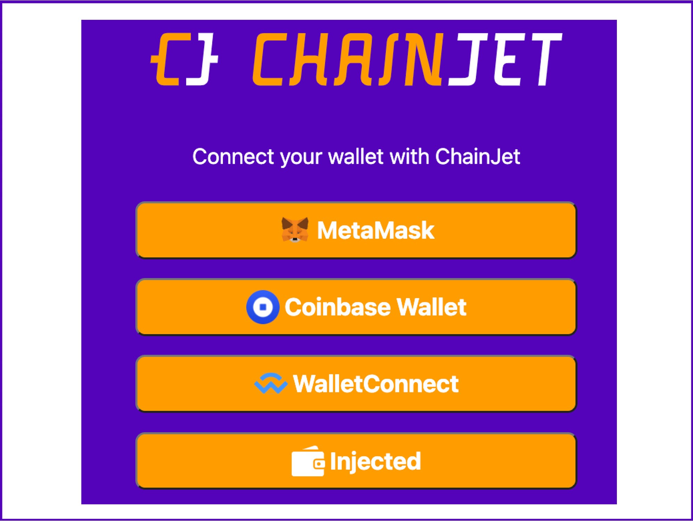
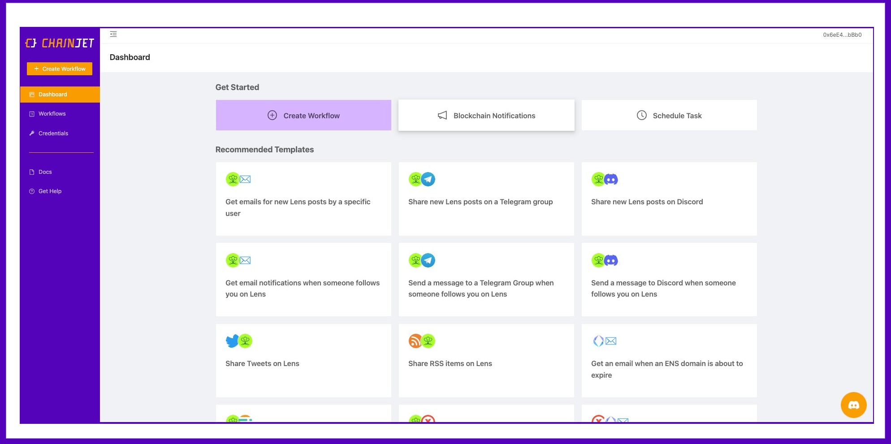
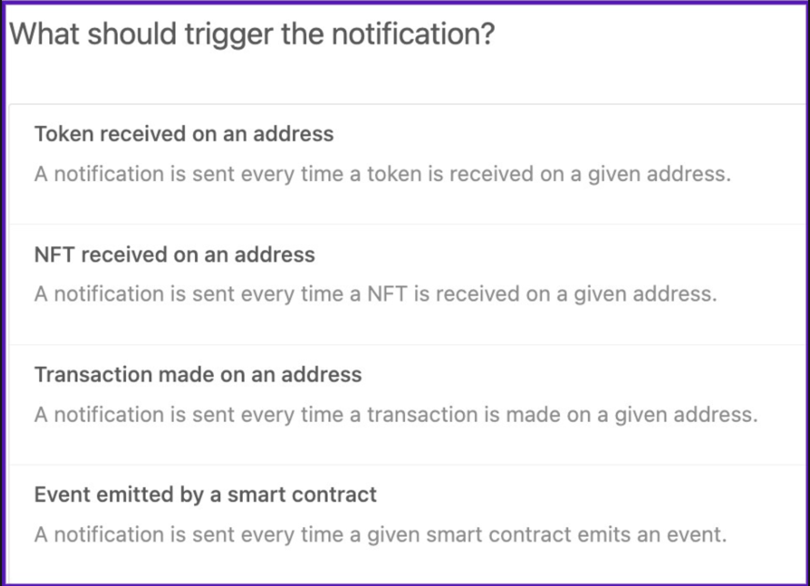
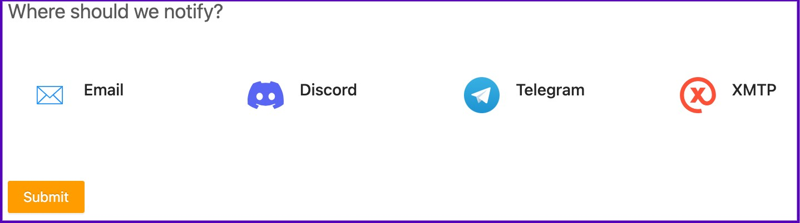

# Quickstart

To start using ChainJet, connect your wallet and sign the message. We use the standard [ERC-4361](https://eips.ethereum.org/EIPS/eip-4361) for the signature authentication.

After you sign-in, you'll find yourself in the Dashboard page, where you'll have different options to get started.

<figure><figcaption></figcaption></figure>

_**"Create Workflow" -**_ It creates an empty workflow. You can add any triggers and actions to automate any kind of task.

_**"Blockchain Notifications" -**_ In this section, you'll find a simplified wizard to create notification-based workflows for blockchain events, token transfers, and more. Select the trigger for your workflow (the event you want to be notified on). You have four options: Tokens received on an address, NFTs received on an address, Transactions made on an address, or new events by smart contracts across 16 different blockchains.

<figure><figcaption></figcaption></figure>

Then, select where you want to be notified: Email, Discord, Telegram, or DMs via XMTP. Finally, connect your account, and your workflow is complete. You will start receiving notifications on the selected event!

<figure><figcaption></figcaption></figure>

_**“Schedule Task” -**_ Easily schedule a task to be executed at a specific date and time. Use the Select Task button to choose the task to schedule, and then enter when it should happen.

<figure><figcaption></figcaption></figure>
