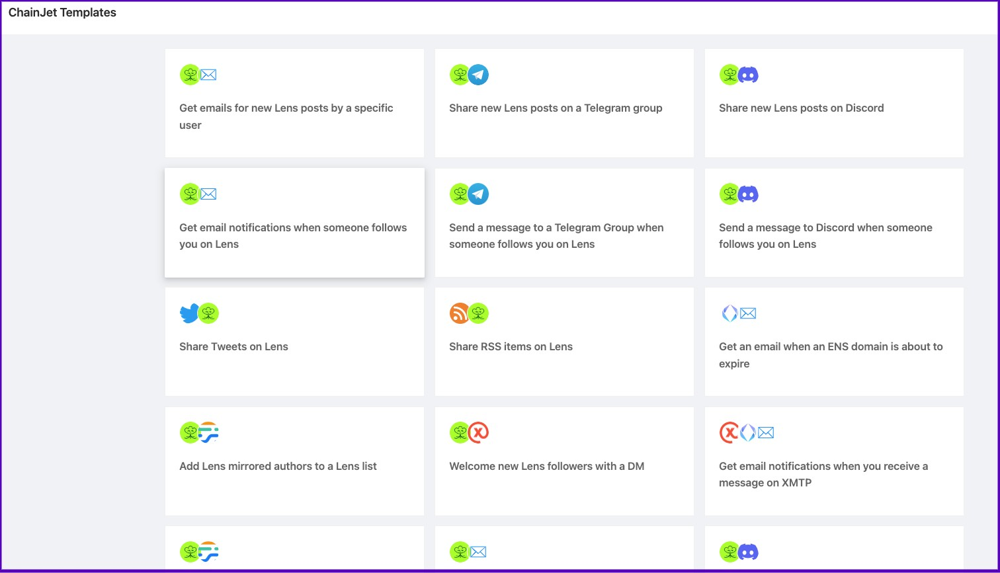
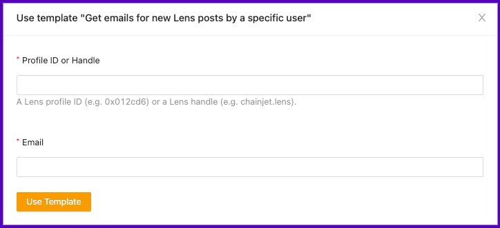
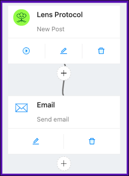

# Templates

First, visit the templates [page](https://chainjet.io/templates) on ChainJet.

<figure><figcaption></figcaption></figure>

Choose the template that suits your needs and click "Use Template".

<figure><figcaption></figcaption></figure>

Fill in the few required fields:

<figure><figcaption></figcaption></figure>

Your workflow is ready!

<figure><figcaption></figcaption></figure>
